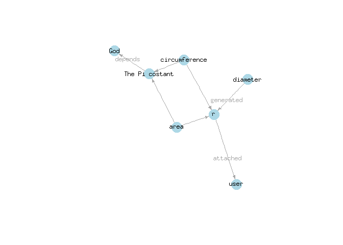

<!-- Grab your social icons from https://github.com/carlsednaoui/gitsocial -->
[1.2]: http://i.imgur.com/wWzX9uB.png (me on Twitter)
[1]: http://www.twitter.com/franapoli
<!-- Grab your social icons from https://github.com/carlsednaoui/gitsocial -->

## Repo

Repo is a data-centered data flow manager. It allows to store R data
files in a central local repository, together with tags, annotations,
provenance and dependence information. Any saved object can then be
easily located and loaded through the repo interface.

A [paper about Repo](http://rdcu.be/pklt) has been published in BMC
Bioinformatics.

Latest news are found in the NEWS.md file of the "Untested" branch.

Repo is developed by Francesco Napolitano [![alt text][1.2]][1]

## Minimal example

Repository creation:

    library(repo)
    rp <- repo_open(tempdir(), T)

    Repo created.

    rp$options(replace=T)

Putting some stuff in (saved on permanent storage):

    rp$put(Inf, "God", "This variable contains the Creator", c("tag1"))
    rp$put(0, "user", "This variable contains a user", c("tag1"))

Putting with dependencies set:

    rp$put(pi, "The Pi costant",
        "This is just a variable containing the Pi costant", c("tag1"), depends="God")

    rp$put(1:10, "r", "10 different radius lengths", c("tag1"), depends="user")

Getting stuff from the repository on the fly:

    diam <- 2 * rp$get("r")
    circum <- 2 * rp$get("The Pi costant") * rp$get("r")
    area <- rp$get("The Pi costant") * rp$get("r") ^ 2

    rp$put(diam, "diameter", "This is the diameter", c("tag1"), depends = "r")
    rp$put(circum, "circumference", "This is the circumference", c("tag1"), depends = c("The Pi costant", "r"))
    rp$put(area, "area", "This is the area", c("tag1"), depends = c("The Pi costant", "r"))

The results:

    rp$get("diameter")

     [1]  2  4  6  8 10 12 14 16 18 20

    rp$get("circumference")

     [1]  6.283185 12.566371 18.849556 25.132741 31.415927 37.699112 43.982297
     [8] 50.265482 56.548668 62.831853

    rp$get("area")

     [1]   3.141593  12.566371  28.274334  50.265482  78.539816 113.097336
     [7] 153.938040 201.061930 254.469005 314.159265

Repository contents:

    print(rp)

                 ID Dims Size
                God    1 44 B
               user    1 41 B
     The Pi costant    1 47 B
                  r   10 61 B
           diameter   10 67 B
      circumference   10 96 B
               area   10 95 B

    rp$info()

    Root:            /tmp/Rtmpej4bxs 
    Number of items: 7 
    Total size:      451 B 

Visualizing dependencies:

    rp$dependencies()

## Development branches

+ [Master](https://github.com/franapoli/repo/tree/master): stable major
releases, usually in sync with lastest CRAN version.

+ [Dev](https://github.com/franapoli/repo/tree/dev): fairly stable
minor releases.

+ [Untested](https://github.com/franapoli/repo/tree/untested):
unstable, in progress versions. Latest news appear in the "NEWS.md"
file of this branch.

## Guides

An introductory vignette is available:

+ [Built from master
branch](https://rawgit.com/franapoli/repo/gh-pages/index.html).

+ [Built from dev
branch](https://rawgit.com/franapoli/repo/gh-pages-dev/index.html).

## Download and Installation

Repo is on CRAN and can be installed from within R as follows:

    > install.packages("repo")
    
However, CRAN versions are not updated very often. Latest stable
release can be downloaded from Github at
[https://github.com/franapoli/repo](https://www.github.com/franapoli/repo/).
Repo can then be installed from the downloaded sources as follows:

    > install.packages("path-to-downloaded-source", repos=NULL)

`devtools` users can download and install at once the latest development
version from github as follows:

    > install_github("franapoli/repo", ref="dev")

