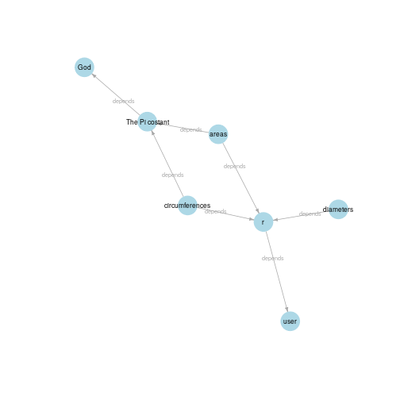

<!-- README.md is generated from README.Rmd. Please edit that file -->


[](https://cran.r-project.org/package=repo)
<sup><sub>Master branch:</sub></sup> [](https://travis-ci.org/franapoli/repo)
<sup><sub>Dev branch:</sub></sup> [](https://travis-ci.org/franapoli/repo)
<sup><sub>Untested branch:</sub></sup> [](https://travis-ci.org/franapoli/repo)
<!-- Grab your social icons from https://github.com/carlsednaoui/gitsocial -->
[1.2]: http://i.imgur.com/wWzX9uB.png (me on Twitter)
[1]: http://www.twitter.com/franapoli
<!-- Grab your social icons from https://github.com/carlsednaoui/gitsocial -->

## Repo

Repo is a data-centered data flow manager. It allows to store R data
files in a central local repository, together with tags, annotations,
provenance and dependence information. Any saved object can then be
easily located and loaded through the repo interface.

A [paper about Repo](http://rdcu.be/pklt) has been published in BMC
Bioinformatics.

Latest news are found in the NEWS.md file of the "Untested" branch.

Repo is developed by Francesco Napolitano [![alt text][1.2]][1]


## Minimal example

Repository creation in the default folder:


```r
    library(repo)
    rp <- repo_open()
```


Putting some stuff (it is saved on permanent storage). In this case,
just values and names are specified:


```r
    rp$put(Inf, "God")
    rp$put(0, "user")
```

Putting specifying dependencies:


```r
    rp$put(pi, "The Pi costant", depends="God")
    rp$put(1:10, "r", depends="user")
```

Getting stuff from the repository on the fly:


```r
    diam <- 2 * rp$get("r")
    circum <- 2 * rp$get("The Pi costant") * rp$get("r")
    area <- rp$get("The Pi costant") * rp$get("r") ^ 2
```

Putting with verbose descriptions:


```r
    rp$put(diam, "diameters", "These are the diameters", depends = "r")
    rp$put(circum, "circumferences", "These are the circumferences",
           depends = c("The Pi costant", "r"))
    rp$put(area, "areas", "This are the areas",
           depends = c("The Pi costant", "r"))
```

Repository contents:


```r
    print(rp)
#>              ID Dims  Size
#>             God    1  51 B
#>            user    1  49 B
#>  The Pi costant    1  55 B
#>               r   10  99 B
#>       diameters   10  75 B
#>  circumferences   10 103 B
#>           areas   10 103 B
```

```r
    rp$info()
#> Root:            /tmp/RtmpuWggyW/zW79im0Pc1xO 
#> Number of items: 7 
#> Total size:      535 B
```

```r
    rp$info("areas")
#> ID:           areas
#> Description:  This are the areas
#> Tags:         
#> Dimensions:   10
#> Timestamp:    2019-12-18 16:20:56
#> Size on disk: 103 B
#> Provenance:   
#> Attached to:  -
#> Stored in:    o7/bu/g5/o7bug58bbc1n94cnrgsb7ozc5b4txe1s
#> MD5 checksum: 56ad410055fedb0cae012d813a130291
#> URL:          -
```

Visualizing dependencies:


```r
    rp$dependencies()
```




## Development branches

+ [Master](https://github.com/franapoli/repo/tree/master): stable major
releases, usually in sync with lastest CRAN version.

+ [Dev](https://github.com/franapoli/repo/tree/dev): minor releases
passing automatic checks.

+ [Untested](https://github.com/franapoli/repo/tree/untested): in
progress versions and prototype code, not necessarily working.


## Manuals

Besides inline help, two documents are available as introductory
material:

+ [A paper published on BMC Bioinformatics](http://rdcu.be/pklt)

+ [An introductory
vignette](https://rawgit.com/franapoli/repo/gh-pages/index.html).


## Download and Installation

Repo is on CRAN and can be installed from within R as follows:

    > install.packages("repo")
    
Latest stable release can be downloaded from Github at
[https://github.com/franapoli/repo](https://www.github.com/franapoli/repo/).
Repo can then be installed from the downloaded sources as follows:

    > install.packages("path-to-downloaded-source", repos=NULL)

`devtools` users can install directly from github as follows:

    > install_github("franapoli/repo", ref="dev")


